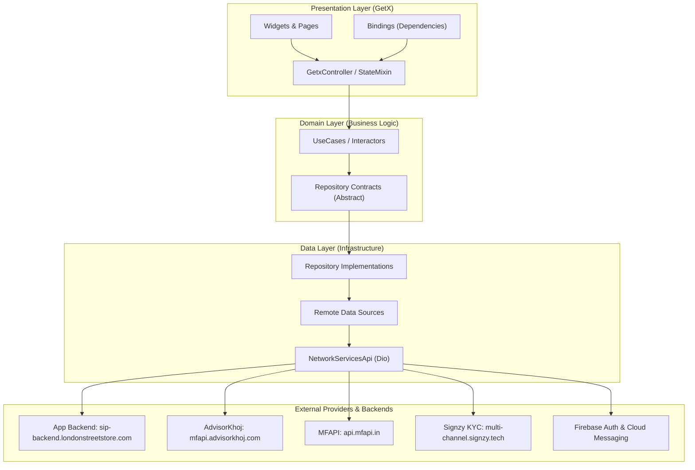
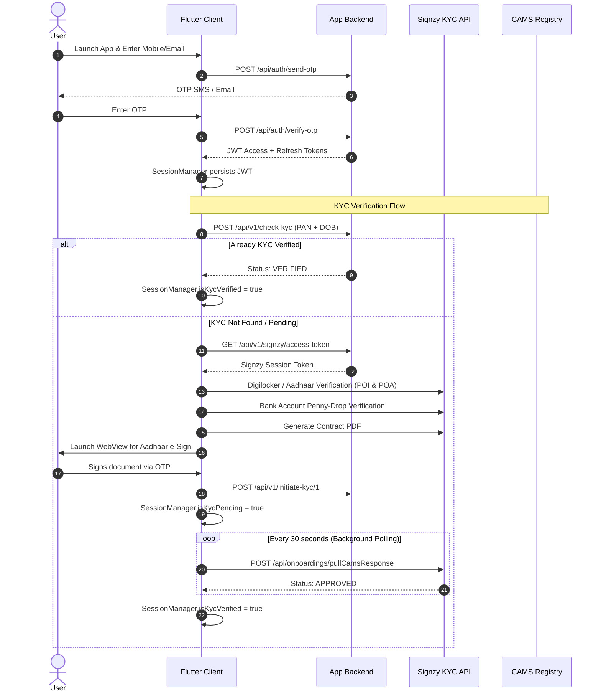
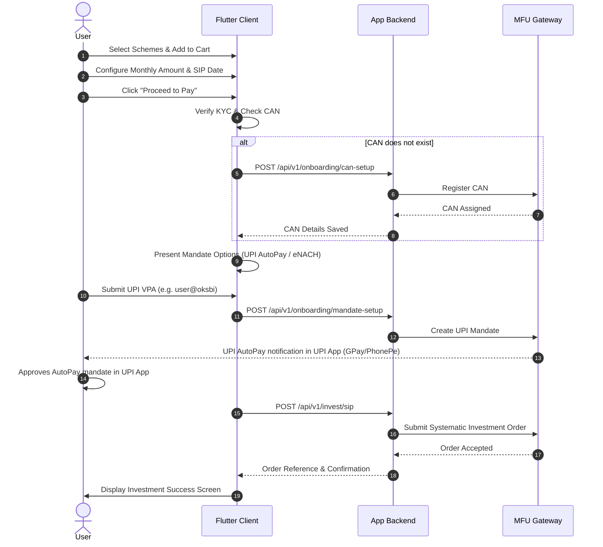

# MF-SIP Application Analysis Summary

## 1. Executive Summary & Architecture Overview

**MF-SIP** (`my_sip`) is a multi-platform Flutter client engineered for mutual fund research, systematic investment planning (SIP), paperless digital KYC (Signzy + CAMS), and transaction execution via **MF Utility (MFU)**.

The application is structured around a **Feature-Driven Clean Architecture** pattern leveraging **GetX** for dependency injection, route management, and reactive state:

```text
Presentation Layer (UI Pages, Widgets, GetX Controllers, Bindings)
      │
      ▼
Domain Layer (Use Cases, Entities, Abstract Repository Contracts)
      │
      ▼
Data Layer (Repository Implementations, Remote Data Sources, Data Models)
      │
      ▼
Network & Services Layer (Dio HTTP Client, Interceptors, SessionManager, Firebase)
      │
      ▼
External Systems (App Backend, AdvisorKhoj, MFAPI.in, Signzy, MFU, Firebase)
```



---

## 2. Technology Stack & Key Dependencies

| Category | Package / Tool | Version | Usage & Responsibilities |
| :--- | :--- | :--- | :--- |
| **Framework** | Flutter / Dart | `^3.9.0` (Dart `3.11+`) | Core cross-platform engine (Android, iOS, Web, Desktop) |
| **State & Routing** | `get` | `^4.7.3` | Reactive state (`Rx`, `Obx`), Dependency Injection (`Get.lazyPut`), Route navigation |
| **Functional Domain** | `dartz`, `equatable` | `^0.10.1`, `^2.0.7` | `Either<Result<T>, ApiError>` functional error handling, value equality |
| **UI & Responsiveness** | `flutter_screenutil`, `responsive_framework`, `gap` | `^5.9.3`, `^1.5.1`, `^3.0.1` | Screen scaling (`Size(390, 844)`), dynamic responsive breakpoints (Mobile, Tablet, Desktop, 4K) |
| **Charts & Gauges** | `fl_chart`, `syncfusion_flutter_gauges`, `percent_indicator` | `^1.1.1`, `^32.1.21`, `^4.2.5` | NAV performance curves, SIP vs Lumpsum projection charts, asset allocation gauges |
| **Networking** | `dio`, `mime` | `^5.9.0`, `^2.0.0` | HTTP requests, Bearer token interceptor, multipart binary uploads, direct S3 streaming |
| **Storage & Security** | `flutter_secure_storage`, `shared_preferences`, `local_auth` | `^9.2.4`, `^2.5.4`, `^3.0.0` | Mobile keychain/keystore encryption, browser web storage, Biometric / PIN app lock |
| **Authentication & Push** | `firebase_core`, `firebase_auth`, `firebase_messaging`, `google_sign_in` | `^4.7.0`, `^6.1.0`, `^16.2.0`, `^6.2.1` | FCM push notifications, Google Sign-in integration |
| **Media & WebViews** | `webview_flutter`, `flutter_inappwebview`, `youtube_player_flutter` | `^4.10.0`, `^6.1.5`, `^9.1.1` | In-app Signzy e-Sign & payment WebViews, educational video embeds |
| **Files & Device** | `image_picker`, `file_picker`, `file_saver`, `path_provider`, `open_filex` | `^1.2.1`, `^11.0.3`, `^0.3.1`, `^2.1.5`, `^4.7.0` | KYC document capture, cheque uploads, PDF download and display |

---

## 3. Core Services & Infrastructure Architecture

### 3.1. Session Manager (`lib/services/session_manager.dart`)
- **Dual Persistence Strategy**:
  - **Mobile**: Uses `FlutterSecureStorage` for hardware-backed encryption of access tokens, refresh tokens, user data, and KYC state.
  - **Web**: Uses `SharedPreferences` (browser storage) to support browser refreshes.
- **Reactive State Managed**:
  - `jwtAccessToken`, `jwtRefreshToken`, `userId`.
  - `userObs` (`Rxn<UserModel>`): Reactive profile updates across widgets.
  - `riskScoreObs` (`Rxn<RiskResultModel>`): Investor risk category and quiz answers.
  - `isKycVerified`, `isKycPending`, `kycError`: Dynamic flags driving UI verification gates.
  - `pending_mandate_data`: Mandate reconciliation cache across app restarts.
  - `isAppLockEnabled`: Biometric app-lock toggle.

### 3.2. Network Architecture (`lib/core/network/network_api_service.dart`)
Implements `BaseApiServices` on top of `Dio` with 4 chained interceptors:
1. **`_HeadersInterceptor`**: Attaches app version and platform identifier (`Android App`, `iOS App`, `Web App`).
2. **`_AuthInterceptor`**: Attaches `Authorization: Bearer <token>` to protected endpoints; skips for public requests on Web to avoid unnecessary CORS preflight.
3. **`_LoggingInterceptor`**: Comprehensive request/response console debugging.
4. **`_ErrorInterceptor`**: Normalizes network faults into explicit exceptions (`BadRequestException`, `UnauthorizedException`, `NoInternetException`, `ServerException`).
5. **Direct S3 Upload**: Handles direct stream or byte uploads for investor documents.

### 3.3. Push Notifications (`lib/services/firebase_services.dart`)
- Handles foreground, background, and terminated message states using Firebase Cloud Messaging (FCM).
- Syncs device token with backend (`/api/v1/device-token`).
- Caches notification history locally in `SharedPreferences` for the in-app notification center.

### 3.4. Offline Network Handler (`lib/services/network_services.dart` & `no_internet_widget.dart`)
- Listens to connectivity changes via `connectivity_plus`.
- Renders an animated overlay whenever internet access is lost.

---

## 4. Comprehensive Feature Breakdown

### 4.1. Onboarding & Authentication
* **Path**: `lib/features/onboarding/`, `lib/features/authentication/`
* **Workflow & Capabilities**:
  - Splash screen routing checks authentication tokens and KYC status to determine starting screen.
  - Onboarding carousel introducing systematic investing and goal tracking.
  - Phone / Email OTP login (`/api/auth/send-otp`, `/api/auth/verify-otp`).
  - Standard password login (`/api/login`) and user registration (`/api/auth/register`).
  - Google OAuth sign-in integration (`/api/auth/google`).
  - Biometric / PIN App Lock on app resume via `local_auth`.

### 4.2. Digital KYC Workflow (Signzy & CAMS)
* **Path**: `lib/features/kyc/`
* **Workflow & Capabilities**:
  - **Check Existing KYC**: Queries backend (`/api/v1/check-kyc`) with PAN and DOB to test existing compliance against CAMS database.
  - **Signzy Initiation**: Requests Signzy session token (`/api/v1/signzy/access-token`).
  - **Proof of Identity (POI)**: Multi-step Digilocker or UIDAI captcha/OTP authentication.
  - **Proof of Address (POA)**: Automated document OCR and data extraction.
  - **Penny Drop Bank Verification**: Initiates bank account validation via penny drop (`/api/onboardings/execute`).
  - **Contract PDF & Aadhaar e-Sign**: Builds KYC contract PDF and opens secure e-Sign WebView.
  - **Silent CAMS Polling**: `NavigationBarController` initiates a 30-second recurring polling loop when `isKycPending == true` to pull approved status from CAMS (`/api/onboardings/pullCamsResponse`).

### 4.3. Mutual Fund Utility (MFU) Integration
* **Path**: `lib/features/mfu/`
* **Workflow & Capabilities**:
  - **CAN (Common Account Number)**: Token-only creation (`/api/v1/onboarding/can-setup`) and status verification (`/api/v1/mfu/call` with `CAN-STATUS`).
  - **Bank Validation**: Cross-checks bank account against CAN records (`/api/mfu/can-bank-validation`).
  - **Mandates (AutoPay)**:
    - UPI AutoPay (`workflowType: "C"`).
    - eNACH Net Banking (`regMode: "PN"`).
    - Mandate status polling (`/api/v1/mfu/mandate/status`).
  - **Transaction Execution**:
    - Lumpsum Purchase (`/api/v1/invest/lumpsum`).
    - Systematic SIP Registration (`/api/v1/invest/sip`).
    - SIP Step-Up Execution (`/api/v1/invest/stepup`).
    - Redemption Request (`/api/v1/invest/redeem`).

### 4.4. Fund Discovery & Search
* **Path**: `lib/features/explore/`, `lib/features/nfo/`
* **Workflow & Capabilities**:
  - Fund house (AMC) list and filtering (SBI, HDFC, ICICI Prudential, Axis, etc.).
  - Category and sub-category filtering using AdvisorKhoj API (`getAllSchemeCategories`).
  - Live search by Scheme Name, ISIN, or AMFI code.
  - Curated baskets: "Best High Growth SIP" and "Suggested Portfolios".
  - New Fund Offers (NFO): Displays active and upcoming fund offerings with closing dates.

### 4.5. Fund Details & Scheme Comparison
* **Path**: `lib/features/fund_details/`
* **Workflow & Capabilities**:
  - Live fund data aggregation from AdvisorKhoj (`getSchemeInfoLatest`) and NAV history from `api.mfapi.in`.
  - Historical returns visualizer: 1M, 6M, 1Y, 3Y, 5Y, and Max timeline charts.
  - In-depth portfolio analysis (`getPortfolioAnalysisNew`): Top 10 stock holdings, sector allocation, equity/debt breakdown.
  - Risk ratios: Standard Deviation, Sharpe Ratio, Beta, Alpha.
  - Fund comparison tool: Multi-fund comparison comparing returns, NAV, AUM, and expense ratios.

### 4.6. Financial Calculators & Freedom SIP
* **Path**: `lib/core/utils/calculator/`, `lib/features/freedom_sip/`, `lib/features/home/presentation/widgets/product_tool/`
* **Workflow & Capabilities**:
  - **SIP Calculator**: Compound interest modeling with monthly effective rate calculation.
  - **Step-Up SIP Calculator**: Calculates annual percentage or fixed-amount increments with year-by-year comparison vs normal SIP.
  - **SWP (Systematic Withdrawal Plan) Calculator**: Models retirement withdrawals and portfolio capital depletion.
  - **Freedom SIP**: Interactive dual-phase planning:
    - Accumulation phase (SIP duration & corpus building).
    - Distribution phase (SWP monthly income payouts).

### 4.7. Cart & Investment Orchestration
* **Path**: `lib/features/cart/`, `lib/features/sip_process/`
* **Workflow & Capabilities**:
  - Shopping cart CRUD (`/api/v1/cart`, `/api/v1/addcart`, `/api/v1/cart/update-item`, `/api/v1/cart/delete-item`).
  - Budget distributor: Allocate a lump-sum monthly amount across multiple schemes.
  - SIP tenure & deduction date selection (e.g., 1st, 5th, 10th, 15th, 25th).
  - Payment screen: Bank selection, UPI AutoPay vs Net Banking mandate creation, and order submission.

### 4.8. Goal Planning & Tracking
* **Path**: `lib/features/goal/`
* **Workflow & Capabilities**:
  - Pre-defined goal templates: Retirement, Child Education, Marriage, Dream Home, Vacation, Emergency Fund.
  - Inflation-adjusted target calculator for future corpus needs.
  - Scheme linking: Assigns specific funds to a goal (`/api/v1/goal-orders/save`).
  - Goal tracking dashboard: Visual progress bars towards milestone completion.

### 4.9. Portfolio Dashboard & Redemption
* **Path**: `lib/features/dashboard/`
* **Workflow & Capabilities**:
  - Total Invested vs Current Valuation, Absolute Gains, and XIRR.
  - Transaction history: Tracks orders by status (Pending, Success, Failed).
  - Active SIP manager: View active mandates with pause/cancellation workflows (with OTP modal verification).
  - Direct redemption: Partial or complete liquidation to primary bank account.

### 4.10. User Personalization & Servicing
* **Path**: `lib/features/personalization/`
* **Workflow & Capabilities**:
  - **Risk Profiling**: 10-question evaluation engine assessing risk capacity (Conservative, Moderate, Aggressive).
  - **Bank Accounts**: Add secondary accounts with IFSC verification and cheque leaf upload (`/api/v1/bank/add`).
  - **Nominee Management**: Add, update, and allocate nominee percentage shares (`/api/v1/nominees`).
  - **Statements**: Generate and download Capital Gain and Account Statements for custom financial years.

---

## 5. End-to-End System Workflows

### 5.1. Authentication & KYC Journey



### 5.2. SIP Investment & AutoPay Mandate Journey



---

## 6. API & Service Integration Matrix

| Service | Base URL | Endpoints Used |
| :--- | :--- | :--- |
| **MF-SIP Application Backend** | `https://sip-backend.londonstreetstore.com` | `/api/login`, `/api/auth/register`, `/api/auth/send-otp`, `/api/auth/verify-otp`, `/api/auth/google`, `/api/v1/device-token`, `/api/v1/check-kyc`, `/api/v1/signzy/access-token`, `/api/v1/initiate-kyc/1`, `/api/v1/onboarding/can-setup`, `/api/v1/onboarding/mandate-setup`, `/api/v1/invest/sip`, `/api/v1/invest/lumpsum`, `/api/v1/invest/stepup`, `/api/v1/invest/redeem`, `/api/v1/cart`, `/api/v1/addcart`, `/api/v1/portfolio`, `/api/v1/transaction`, `/api/v1/goals`, `/api/v1/risk-questions`, `/api/v1/banks`, `/api/v1/nominees` |
| **AdvisorKhoj API** | `https://mfapi.advisorkhoj.com` | `/getSchemeInfoLatest`, `/getPortfolioAnalysisNew`, `/getAllSchemeCategories`, `/navHistory` |
| **MFAPI.in** | `https://api.mfapi.in/mf` | Historical daily NAV time-series endpoint |
| **Signzy Multi-Channel API** | `https://multi-channel.signzy.tech` | `/api/onboardings/execute`, `/api/onboardings/updateForm`, `/api/onboardings/upload`, `/api/captchas/get`, `/api/onboardings/pullCamsResponse` |
| **Firebase** | Google Cloud Services | Firebase Authentication, Firebase Cloud Messaging (FCM) |

---

## 7. Cross-Platform & Responsive Behavior

- **Mobile Navigation**: Bottom Navigation Bar (`Home`, `Explore`, `Dashboard`, `Goals`, `Profile`) with persistent bottom sheets.
- **Web Navigation**: Responsive sidebar navigation drawer, top search header, path-based URL syncing (`usePathUrlStrategy()`), and breadcrumb navigation.
- **Web Resolution Guard**: Screens smaller than `1024px` on Web are routed to `WebRestrictionScreen` to ensure optimal dashboard experience.
- **Breakpoints**:
  - Mobile: `0 - 450px`
  - Tablet: `451 - 800px`
  - Desktop: `801 - 1920px`
  - 4K: `> 1920px`

---

## 8. Development & Production Readiness Observations

1. **Environment Configuration**: API endpoints are static constants in [`lib/core/utils/constant/appUrl.dart`](file:///D:/Mobile%20App/MF-SIP/lib/core/utils/constant/appUrl.dart) (`isProduction = true`). Migrating to compile-time environment variables (`--dart-define` or `.env`) is recommended for Dev, UAT, and Production builds.
2. **API Keys**: AdvisorKhoj API key is embedded directly in query parameters in client code. Routing these requests through the application backend can prevent credential exposure.
3. **Storage Security**: Mobile uses `FlutterSecureStorage` (hardware-backed Keystore/Keychain), while Web uses `SharedPreferences` (HTML5 LocalStorage).
4. **Testing Coverage**: Test files in `test/` currently contain template counter tests. Unit tests for financial formulas (SIP, SWP, Step-Up), SessionManager state transitions, and MFU/KYC serialization should be added.
5. **Detailed Provider Documentation**: Reference documentation for Signzy KYC and MFU APIs are maintained in the repository under [`docs/kyc/`](file:///D:/Mobile%20App/MF-SIP/docs/kyc/) and [`docs/mfu/`](file:///D:/Mobile%20App/MF-SIP/docs/mfu/).
